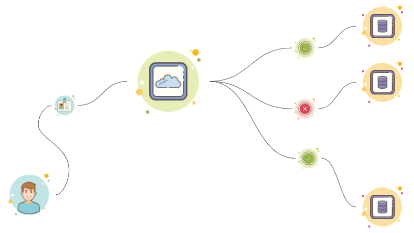

# Concept

## 사용자 신청과 승인sdfsd

 사용가는 자신이 사용할 ID를 Petra Data Studio를 통해 신청면 관리자는 해당 신청에 대한 승인/반려 처리가 가능합니다.

##  사용자 로그인과 데이터베이스 접근

 사용자는 승인 된 ID로 Petra Data Studio에 접속할 수 있으며 본인에게 허용 된 데이터베이스를 선택해 접속할 수 있습니다. 

##  데이터 조회 및 리포팅

 사용자는 접속한 데이터베이스 내 데이터를 조회하거나 객체에 대한 생성문 추출이 가능하고, 조회 된 데이터나 질의어를 사용하여 보고서를 추출할 수 있습니다. 

