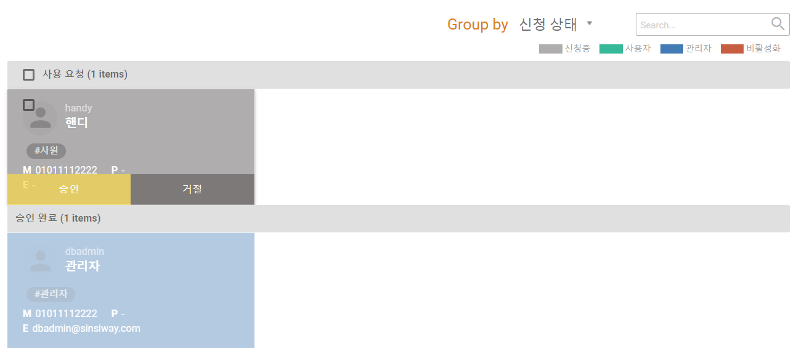

# 조직/사용자 관리

 로그인 한 사용자의 권한이 **관리자** 이상이면 로그인 후 메뉴 \( \) 를 통해 **`사용자 관리`** 페이지로 접속할 수 있습니다. 

| menu | content |
| :--- | :--- |
| 조직 관리   | 화면 좌측의 트리구조 조직 관리  |
| 사용자 관리  | 화면 우측의 카드 구조 사용자 관리  |

