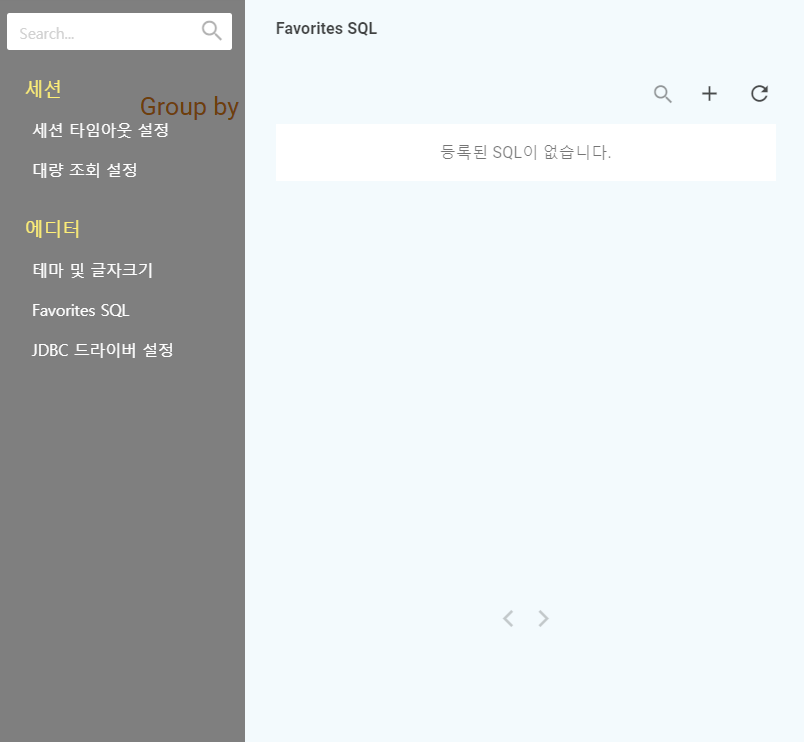
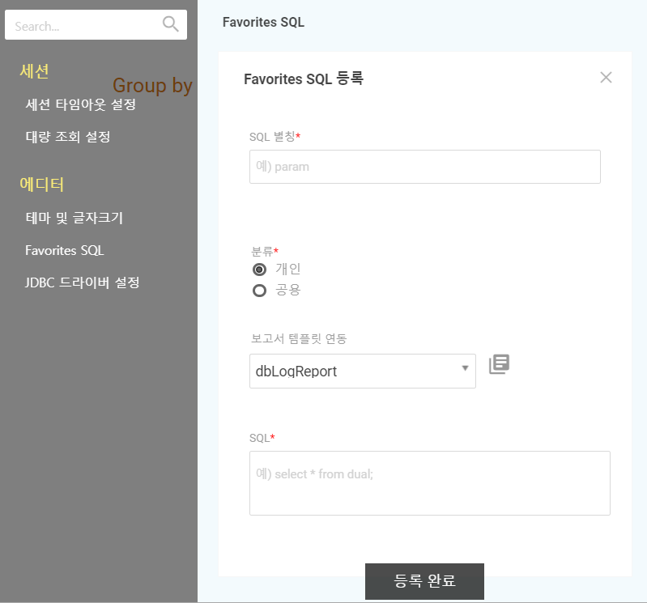

# Favorites SQL

 자주 사용되는 SQL을 등록 / 삭제 / 재사용 할 수 있습니다. 

##  Favorites SQL 등

 화면의 플러스\(\) 아이콘을 클릭하면 다음과 같은 Favorites SQL 등록 화면이 나옵니다. 

| name | content |
| :--- | :--- |
|  SQL 별칭 \* | 등록할 SQL의 별칭  |
|  분류 \*  |  개인 또는 공용 사용 분류 |
|  보고서 템플릿 연동  |  기존 등록 된 보고서 템플릿과 연동 |
|  SQL \*  |  실행할 SQL |

