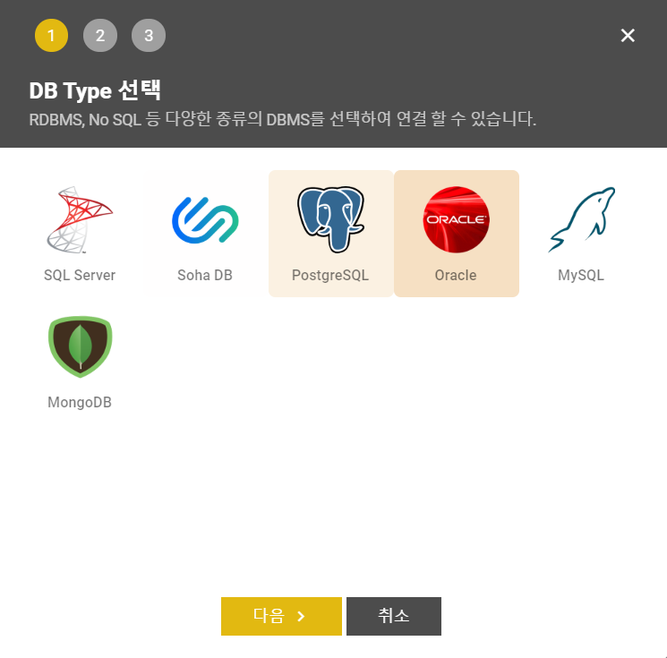
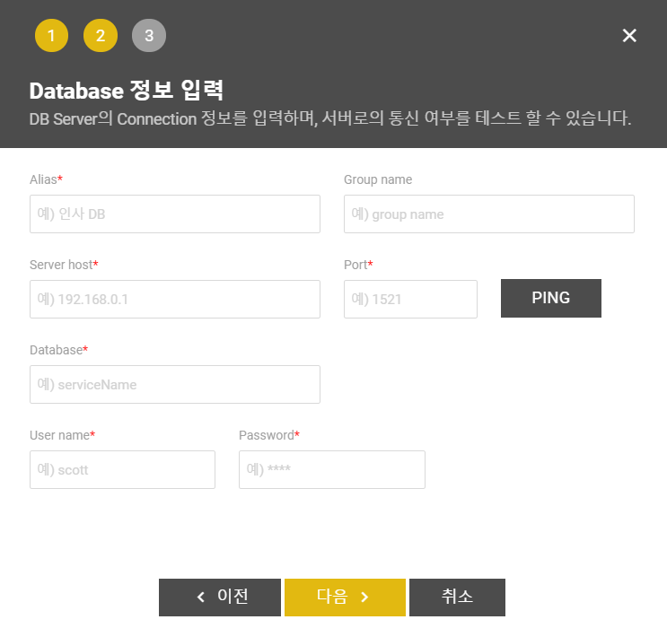
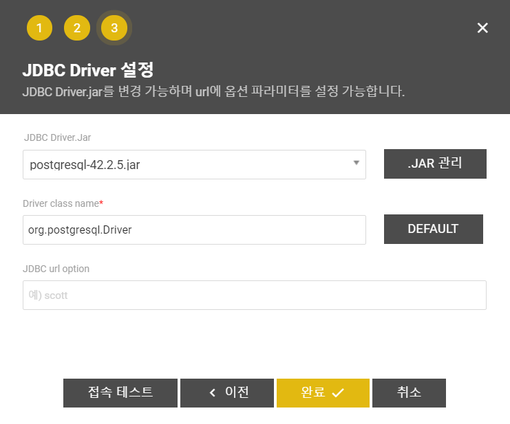

# 데이터베이스 생성

 메인 화면의 접근 가능한 DBMS 목록 메뉴 옆 플러스\(\) 아이콘 틀릭 시 다음과 같은 DBMS 등록 인터페이스가 나옵니다. 

  DBMS를 등록하는 과정은 총 3단계로 진행됩니다. 

##  DB Type 선택 

 등록하고자 하는 DMBS의 종류를 선택하는 단계입니다. 등록 가능한 DBMS는 [What is Petra Data Studio?](../what-is-petra-data-studio.md) 페이지에서 확인하실 수 있습니다. 

##   Database 정보 입력

 2단계는 접속하고자 하는 Database의 정보를 입력하는 란입니다. 

| name | content |
| :--- | :--- |
|  Alias \* |  저장하는 dbms의 별칭.  |
|  Group name |  데이터베이스 그룹.  |
|  Server host \* |  데이터베이스 host  |
|  Port \* |  데이터베이스 Port  |
|  Database \* |  데이터베이스 이름\(접속용\)  |
|  User name \* |  데이터베이스 사용자  |
|  Password \* |  데이터베이스 사용자 비밀번호  |

 데이터베이스 종류에 따라 Database \* 입력은 Service name 으로 표시될 수도 있습니다.\(Oracle 기준\)

##  JDBC Driver 설정  

 접속하고자 하는 DBMS Type 및 버전에 따라 사용되는 jdbc driver를 선택할 수 있습니다. 원하는 jdbc driver 파일이 없을 때 `.JAR 관리` 버튼을 클릭하면 jdbc driver를 추가 등록 및 관리할 수 있습니다. 

 Driver class name 은 뭐지?

 JDBC url option은 어떨 때 사용되지?ㅡ 

